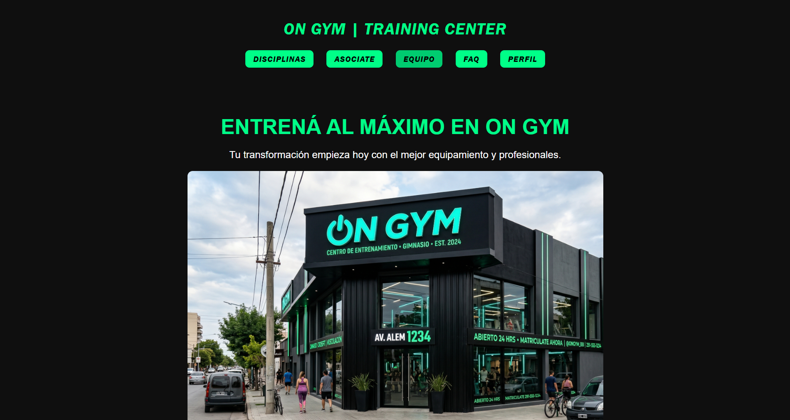

# ON GYM | Training Center - Front-End (TP3)

 

Proyecto de desarrollo web para el **Trabajo Práctico N°3** de Programación III. Esta etapa consiste en la evolución dinámica del sitio web maquetado en los prácticos anteriores, integrando el consumo asíncrono de una API REST propia desplegada en **Render** para reemplazar los datos estáticos y gestionar un sistema completo de usuarios.

## 📖 Descripción del Proyecto

El sitio web de **ON GYM** permite a los usuarios explorar las instalaciones, informarse sobre las disciplinas de alto rendimiento y conocer al staff técnico. A partir del TP3, la plataforma incorpora interactividad en tiempo real: renderizado dinámico de contenidos desde el servidor, registro de nuevos socios, inicio de sesión seguro y un panel de perfil personalizado que persiste en el navegador.

---

## 👥 Grupo 16 - Integrantes y División de Tareas

El desarrollo y refactorización del código se distribuyó equitativamente entre los integrantes para asegurar que todos apliquen conceptos de asincronismo, peticiones HTTP y manipulación del DOM:

* **Priscila Arrimada:** `contacto.html`.
* **Tomás Astudillo:** `equipo.html`, `equipo.js`.
* **Valentina Guerrieri:** `faq.html`, `faq.js`.
* **Máximo Messina:** `index.html`, `index.js`, `login.html`, `login.js`, `registro.html`, `registro.js`, `perfil.html` y `perfil.js`.
* **Máximo Moraes:** `servicios.html`, `servicios.js`.
* **Lucas Rojas:** `pedido.html` y `infoped.js`.

---

## 📂 Distribución de Archivos y Carpetas

La arquitectura del proyecto cliente respeta una separación estricta de recursos:

```text
📁 TP3-front-dev/
├── 📁 assets/          # Recursos gráficos (imágenes del gimnasio, staff, íconos y favicon)
├── 📁 css/             # Hojas de estilo globales y modulares (style.css)
├── 📁 js/              # Controladores del Front-End (Lógica asíncrona y consumo de API)
│   ├── equipo.js
│   ├── faq.js
│   ├── index.js
│   ├── login.js
│   ├── perfil.js
│   ├── registro.js
│   └── servicios.js
├── 📁 pages/           # Vistas secundarias del sitio
│   ├── contacto.html
│   ├── equipo.html
│   ├── faq.html
│   ├── login.html
│   ├── pedido.html
│   ├── perfil.html
│   ├── registro.html
│   └── servicios.html
└── 📄 index.html       # Página principal (Home)

```
---

## 🛠️ Metodología de Trabajo con Git y GitHub

Para el desarrollo colaborativo se aplicó un flujo de trabajo basado en ramas (Branching Model):

* Ramas Principales: Se mantuvo la rama main exclusiva para código estable y entregable, utilizando una rama dev como entorno de integración y pruebas de despliegue con Render.

* Ramas Personales: Cada integrante trabajó las tareas asignadas en su propia rama local siguiendo la nomenclatura alumno-apellido.

* Integración (Pull Requests): Cumpliendo con las normas de la cátedra, cada alumno generó commits descriptivos en su rama y abrió un Pull Request hacia dev/main para someter el código a revisión antes de realizar la mezcla (merge) definitiva, evitando conflictos estructurales.

---

## Explicación de Funciones:

* `login.js` (Event Listener submit): Intercepta el envío del formulario, previene el comportamiento por defecto (e.preventDefault()) y captura las credenciales. Realiza una petición fetch por método POST enviando un cuerpo JSON a la API en Render. Si la respuesta es exitosa (respuesta.ok), guarda el id del usuario en el localStorage para mantener la sesión activa y redirige a perfil.html. Caso contrario, notifica el error de credenciales.

* `registro.js` (Event Listener submit): Utiliza la clase FormData y Object.fromEntries() para mapear automáticamente todos los inputs del formulario en un objeto plano. Realiza una validación defensiva comparando que password y confirm_password coincidan. Posteriormente, envía los datos mediante POST al endpoint de registro y, tras el alta exitosa en el servidor, redirige a la vista de login.

* `perfil.js` cargarDatosPerfil(): Se ejecuta automáticamente al cargar el DOM. Recupera el usuarioId desde el localStorage y realiza una petición GET a la ruta protegida /api/perfil/${userId}. Inyecta los datos personales (nombre, email, objetivo) en las etiquetas correspondientes. Además, itera sobre el array de pedidos del usuario para renderizar tarjetas de servicios contratados o, de forma dinámica, plasma un Empty State (mensaje informativo) si el usuario aún no posee planes activos. cerrarSesion(): Elimina el rastro del usuarioId del localStorage y redirige de forma segura a la página de inicio (index.html), cerrando el ciclo de la sesión.

* `index.js` cargarContenidoPrincipal(): Se encarga de construir la página de inicio solicitando información centralizada al servidor. Implementa un Efecto de Carga: detecta el elemento spinner/cargando (#loading) y lo oculta (style.display = 'none') únicamente cuando la promesa del fetch se resuelve con éxito. Luego, distribuye dinámicamente el bloque Hero, las clases destacadas y la galería de instalaciones. Posee un bloque catch que renderiza un mensaje de error amigable en el DOM si el servidor de Render se encuentra en reposo (sleep).